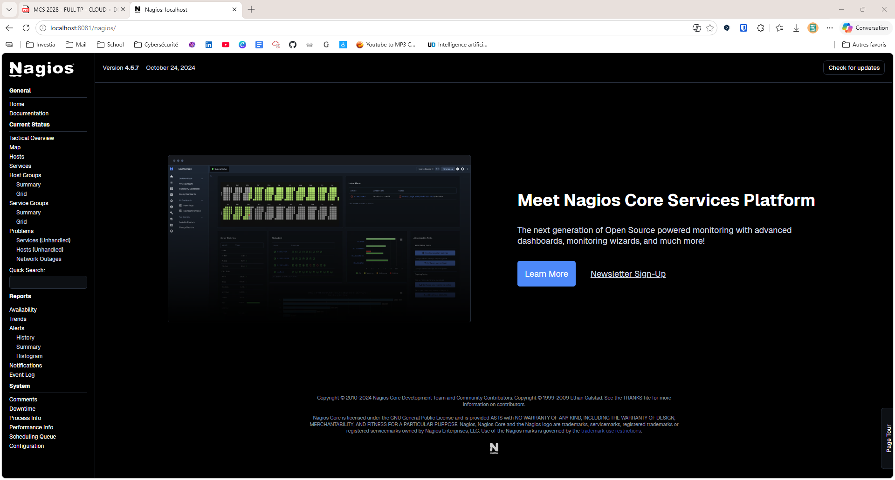
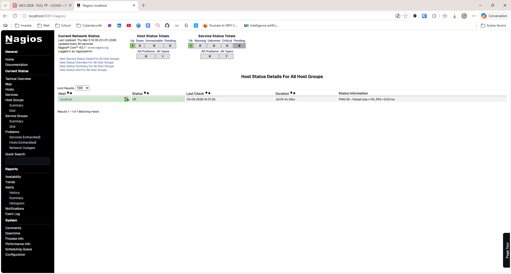

# Déployer Nagios facilement avec Docker


La supervision est un élément essentiel de toute infrastructure informatique.  
Elle permet de surveiller la disponibilité des serveurs, des services et des équipements réseau afin de détecter rapidement les incidents.

Dans cet article, nous allons voir comment **déployer rapidement Nagios grâce à Docker**, sans installation complexe sur le système.

En quelques commandes, nous obtiendrons une **plateforme de supervision fonctionnelle accessible via un navigateur web**.

---

# Qu’est-ce que Nagios ?

Nagios est une solution de supervision open source largement utilisée dans les environnements informatiques.

Elle permet de surveiller :

* des serveurs Linux ou Windows
* des services réseau (HTTP, SSH, DNS, SMTP…)
* des équipements réseau
* la disponibilité et les performances des systèmes

Nagios peut également envoyer des **alertes automatiques** lorsqu’un service tombe en panne ou lorsqu’un problème est détecté.

---

# Pourquoi utiliser Docker ?

Docker permet d’exécuter des applications dans des conteneurs isolés.

Les conteneurs offrent plusieurs avantages :

* installation très rapide
* environnement isolé
* portabilité entre machines
* déploiement reproductible

Grâce à Docker, il n’est pas nécessaire d’installer Nagios manuellement avec toutes ses dépendances.

---

# Installer Docker sur sa machine

Avant de déployer Nagios, il est nécessaire d’installer Docker sur la machine.

Les étapes peuvent varier selon le système d’exploitation.

---

## Installation sur Linux (Ubuntu / Debian)

Mettre à jour le système :

```bash
sudo apt update
```

Installer Docker :

```bash
sudo apt install docker.io
```

Démarrer le service Docker :

```bash
sudo systemctl start docker
```

Activer Docker au démarrage :

```bash
sudo systemctl enable docker
```

Vérifier l’installation :

```bash
docker --version
```

---

## Installation sur Windows ou macOS

Pour Windows ou macOS, il suffit d’installer **Docker Desktop** depuis le site officiel :

[https://www.docker.com/products/docker-desktop](https://www.docker.com/products/docker-desktop)

Une fois installé, Docker peut être utilisé directement depuis le terminal.

---

# Image Docker utilisée

Pour ce déploiement, nous utilisons l’image maintenue par Jason Rivers :

```
https://hub.docker.com/r/jasonrivers/nagios
```

Cette image contient déjà :

* Nagios
* Apache
* les plugins de supervision
* une configuration de base

Cela permet de lancer Nagios très rapidement.

---

# Récupération de l’image Nagios

La première étape consiste à télécharger l’image depuis Docker Hub.

```bash
docker pull jasonrivers/nagios
```

Cette commande récupère l’image afin de pouvoir créer un conteneur localement.

---

# Déploiement du conteneur Nagios

Une fois l’image téléchargée, il suffit de lancer un conteneur.

```bash
docker run -d --name nagios -p 8081:80 jasonrivers/nagios
```

Explication des options utilisées :

| Option               | Description                                         |
| -------------------- | --------------------------------------------------- |
| `-d`                 | lance le conteneur en arrière-plan                  |
| `--name nagios`      | donne un nom au conteneur                           |
| `-p 8081:80`         | redirige le port 8081 vers le port 80 du conteneur |
| `jasonrivers/nagios` | image Docker utilisée                               |

Le conteneur démarre immédiatement.

---

# Accéder à l’interface web

Une fois le conteneur lancé, l’interface web de Nagios est accessible à l’adresse suivante :

```
http://localhost:8081/nagios
```

Identifiants par défaut :

```
User : nagiosadmin
Password : nagios
```



---

# Vérification des hôtes supervisés

Dans l’interface Nagios, le menu suivant permet de consulter l’état des machines supervisées :

```
Hosts → Host Status
```

Par défaut, Nagios surveille :

```
localhost
```

Si l’état est **UP**, cela signifie que la machine répond correctement aux tests de supervision.



---

# Vérifier le conteneur Docker

Pour vérifier que le conteneur fonctionne correctement :

```bash
docker ps
```

Cette commande affiche la liste des conteneurs en cours d’exécution.

Vous devriez voir le conteneur **nagios** actif.

---

# Avantages de ce déploiement

L’utilisation de Docker permet de déployer Nagios très rapidement.

Cette approche offre plusieurs avantages :

* déploiement en quelques secondes
* environnement isolé
* installation simplifiée
* portabilité entre machines

C’est une excellente solution pour tester une plateforme de supervision dans un **lab ou un environnement de formation**.

---

# Conclusion

Grâce à Docker, il est possible de déployer rapidement une solution de supervision complète comme Nagios.

En seulement quelques commandes, nous obtenons une **plateforme opérationnelle accessible via une interface web**, sans configuration complexe.

Cette méthode est particulièrement intéressante pour :

* les laboratoires d’apprentissage
* les environnements de test
* les projets DevOps ou cybersécurité.
