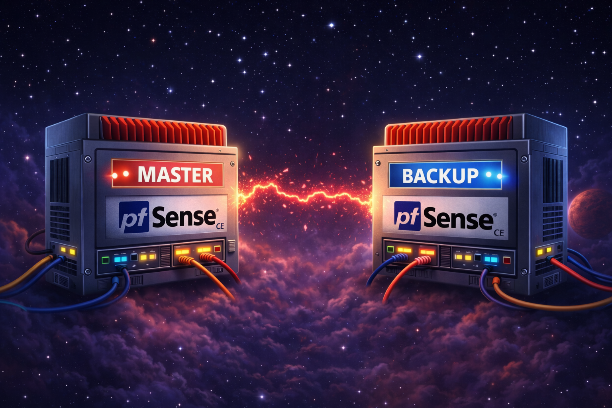
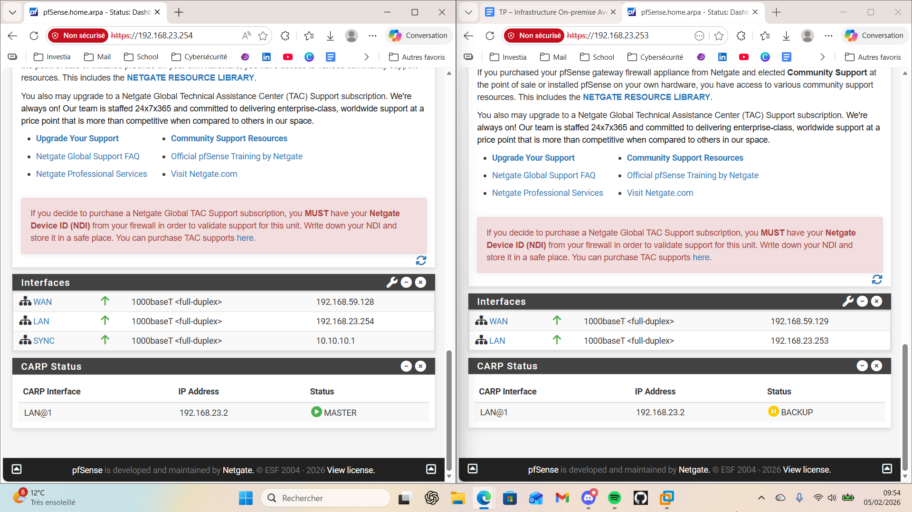

# 🔥 Mise en place d’un firewall pfSense en Haute Disponibilité (HA) avec CARP – Walkthrough complet



## 📌 Contexte

Dans une infrastructure professionnelle, le **pare-feu est un point critique** :
s’il tombe, **tout le réseau tombe**.

L’objectif de ce walkthrough est de montrer **pas à pas** comment :

* installer **pfSense Community Edition**
* configurer un firewall fonctionnel (WAN / LAN / DHCP)
* mettre en place une **Haute Disponibilité**
* assurer la **continuité de service** grâce à **CARP**

👉 Ce guide se concentre **uniquement sur pfSense**, sans aborder la partie Windows (serveur ou client).

---

## 🧑‍💻 Informations

* **Auteur :** Swapshadow
* **Version :** 1.1
* **Dernière mise à jour :** 05/02/2026 – 18:08

---

## 🧭 Sommaire

1. Pré-requis et architecture
2. Création des machines virtuelles pfSense
3. Installation de pfSense CE
4. Configuration initiale WAN / LAN
5. Activation du DHCP et accès GUI
6. Configuration des règles firewall
7. Ajout de la 3ᵉ interface SYNC
8. Mise en place de la HA (pfsync + XMLRPC)
9. Configuration de CARP et de la VIP
10. Tests de bascule
11. Bonnes pratiques et erreurs à éviter
12. Conclusion

---

## 🏗️ 1. Pré-requis et architecture

### Architecture retenue

Nous utilisons **2 firewalls pfSense** :

| Nom | Rôle   |
| --- | ------ |
| FW1 | MASTER |
| FW2 | BACKUP |

Chaque firewall possède **3 interfaces réseau** :

* 🌐 **WAN** → accès Internet
* 🖧 **LAN** → réseau interne
* 🔁 **SYNC** → synchronisation HA

Une **VIP CARP** est utilisée comme **passerelle unique** pour les clients.

---

## 💻 2. Création des machines virtuelles pfSense

### Ressources recommandées

* CPU : 1 vCPU
* RAM : 1 Go
* Disque : 20 Go
* OS invité : FreeBSD 64 bits

### Interfaces réseau VMware

Pour **FW1 et FW2** :

| Interface | Type VMware        | Rôle |
| --------- | ------------------ | ---- |
| Carte 1   | NAT                | WAN  |
| Carte 2   | Host-Only (VMnet1) | LAN  |
| Carte 3   | Host-Only (VMnet2) | SYNC |

⚠️ **Important** :

* LAN et SYNC doivent être **sur des VMnet différents**
* FW1 et FW2 doivent partager les **mêmes VMnet**

---

## 💿 3. Installation de pfSense CE

1. Démarrer la VM sur l’ISO Netgate Installer
2. Sélectionner **Install pfSense CE**
3. Conserver les options par défaut :

   * ZFS
   * GPT
   * Stripe
4. Lancer l’installation
5. Redémarrer et **retirer l’ISO**

👉 pfSense démarre ensuite sur le disque installé.

---

## ⚙️ 4. Configuration initiale via la console pfSense

### Passage du clavier en AZERTY 🇫🇷

Dans la console :

```
8
kbdcontrol -l fr
```

---

### Assignation des interfaces

Menu console → **Option 1 – Assign Interfaces**

Exemple :

| Interface | Nom         |
| --------- | ----------- |
| em0       | WAN         |
| em1       | LAN         |
| em2       | OPT1 (SYNC) |

Renommer **OPT1 → SYNC**.

---

## 🌐 5. Configuration LAN et DHCP

Menu console → **Option 2 – Set Interface IP**

### LAN (FW1)

* IP : `192.168.23.254/24`
* Gateway : aucune
* DHCP : **activé**
* Plage : `192.168.23.100 – 192.168.23.200`
* IPv6 : désactivé

### LAN (FW2)

* IP : `192.168.23.253/24`
* DHCP : **désactivé**

⚠️ Le DHCP sera synchronisé depuis le MASTER.

---

### Accès à l’interface Web

Depuis le poste hôte ou un client LAN :

```
https://192.168.23.254
```

Connexion par défaut → mot de passe modifié immédiatement 🔐

---

## 🔥 6. Configuration des règles firewall

### WAN 🚫

* Aucun trafic entrant autorisé
* Blocage RFC1918 et bogons

### LAN ✅

Créer les règles suivantes :

1. **LAN → Internet**

   * Source : LAN subnets
   * Destination : any
   * Protocole : any

2. **Autoriser ICMP**

   * Protocole : ICMP
   * Type : Echo Request

---

## 🔁 7. Configuration de l’interface SYNC

Menu console → **Option 2**

### FW1

* IP SYNC : `10.10.10.1/24`
* Pas de gateway

### FW2

* IP SYNC : `10.10.10.2/24`
* Pas de gateway

---

## ♻️ 8. Activation de la Haute Disponibilité

### pfsync – Synchronisation des états

Sur **FW1 et FW2** :

* System → High Availability Sync
* Cocher **Synchronize states**
* Interface : SYNC
* Peer :

  * FW1 → `10.10.10.2`
  * FW2 → `10.10.10.1`

---

### XMLRPC Sync – Synchronisation configuration

⚠️ **Uniquement sur FW1 (MASTER)**

* Synchronize Config to IP : `10.10.10.2`
* Username / Password : admin FW2
* Cocher :

  * Firewall rules
  * NAT
  * Virtual IPs
  * DHCP Server

👉 FW2 devient automatiquement une copie du FW1.

---

## 🌐 9. Configuration de CARP (VIP)

Sur **FW1 uniquement** :

* Firewall → Virtual IPs → Add
* Type : CARP
* Interface : LAN
* IP : `192.168.23.1/24`
* VHID : 1
* Password : commun aux deux firewalls
* Advertising :

  * FW1 : skew bas (0)
  * FW2 : skew élevé (100)

La VIP est automatiquement synchronisée sur FW2.

---

## 🧪 10. Tests de bascule

### Test réalisé

1. Arrêt volontaire de FW1
2. Observation du statut CARP

### Résultat attendu ✅

* FW2 passe **MASTER**
* Ping client ↔ réseau **continu**
* IP client inchangée
* Passerelle = VIP CARP

🎯 **Bascule transparente**

---

## ⚠️ 11. Bonnes pratiques et erreurs à éviter

✔️ Toujours distribuer la **VIP comme passerelle DHCP**
✔️ Ne jamais mettre SYNC dans le même réseau que LAN
✔️ Vérifier les IP VMware VMnet
⚠️ Attention aux règles GUI (anti-lockout)
⚠️ Toujours tester la HA **avant** mise en production

---

## ✅ Conclusion

Ce walkthrough montre qu’il est possible de mettre en place une **architecture firewall professionnelle, redondée et fiable** avec pfSense Community Edition.

Grâce à :

* pfsync
* XMLRPC Sync
* CARP
* VIP

l’infrastructure garantit :

* 🔒 sécurité
* 🔁 haute disponibilité
* 🚀 continuité de service

Ce socle peut ensuite être enrichi (IDS/IPS, VLANs, VPN, supervision).


