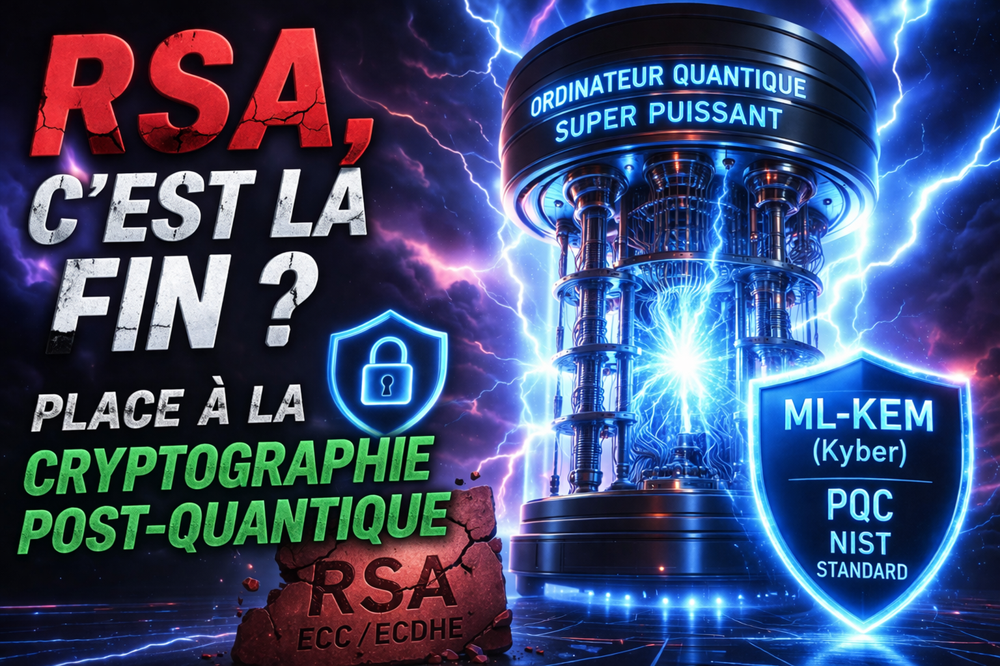

# 🔐 Is RSA over? Enter post-quantum cryptography



## 🧠 Quantum computing is approaching fast

For years, major tech players such as Google, IBM, and Microsoft have invested heavily in quantum computing.

👉 Goal: build machines able to solve some problems **exponentially faster** than classical computers.

### ⚠️ Problem

Current algorithms such as:

- RSA
- ECDSA
- ECDHE

rely on mathematical problems (factorization, discrete logarithm)
👉 **that can be broken by a sufficiently powerful quantum computer** (Shor's algorithm).

## 🏛️ NIST PQC competition

To anticipate this threat, NIST launched a global post-quantum cryptography competition in **2016**.

### 🏆 Results (2022–2024)

- **Kyber → ML-KEM (standardized)** for key exchange
- **Dilithium → ML-DSA**, Falcon, and SPHINCS+ for signatures

👉 Kyber (ML-KEM) is now **the primary PQC TLS standard**.

## 🌍 Current adoption

Several organizations already use PQC-oriented approaches:

- Cloudflare → Hybrid TLS (classical + PQC)
- Google → Chrome + PQC TLS experiments
- Signal → PQC protection for communications

👉 Current strategy: **Hybrid = classical security + post-quantum security**.

## 🧪 Testing PQC with OpenSSL 3.5

👉 **OpenSSL 3.5 supports ML-KEM (Kyber)**.

```bash
git clone https://github.com/openssl/openssl.git
cd openssl
git checkout openssl-3.5.0
./Configure
make -j$(nproc)
sudo make install
```

### 🔑 TLS 1.3 with Kyber (ML-KEM)

```bash
openssl s_server -tls1_3 -accept 4433 -cert server-cert.pem -key server-key.pem -groups MLKEM768
```

```bash
openssl s_client -tls1_3 -connect 127.0.0.1:4433 -groups MLKEM768
```

Expected output:

```text
Negotiated TLS1.3 group: MLKEM768
```

## 🚀 Conclusion

Traditional cryptography is not dead yet—but it is no longer future-proof on its own.

👉 PQC is no longer theory; it is an active transition.
